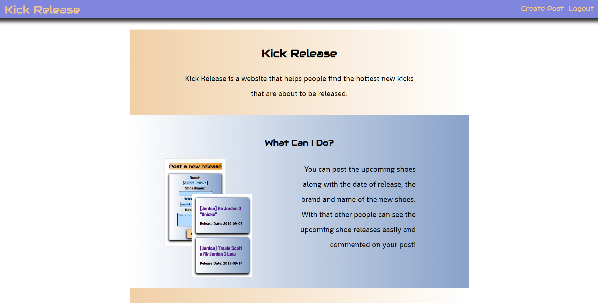
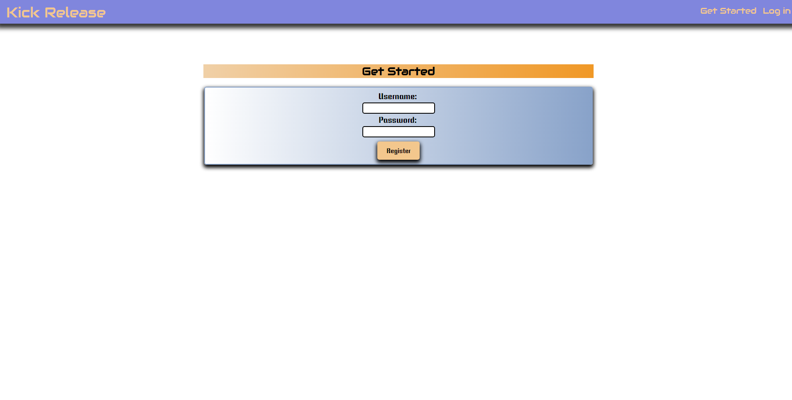
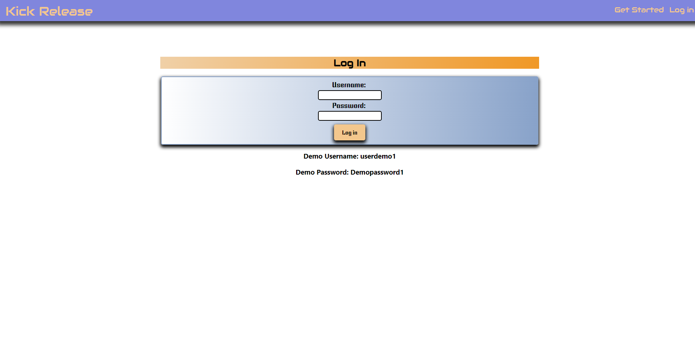
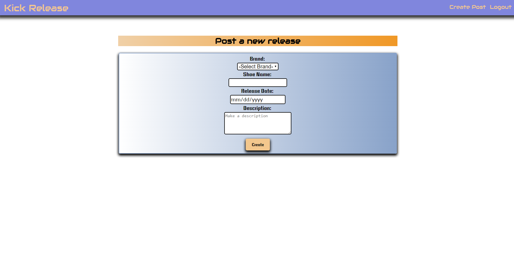
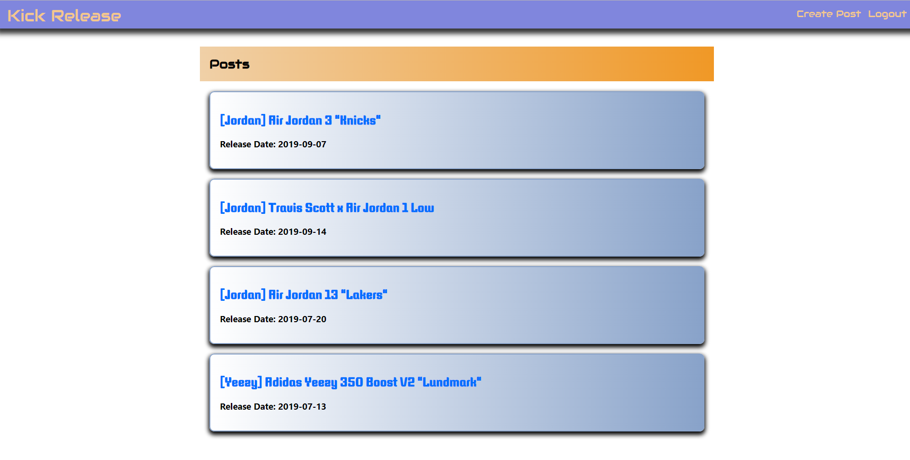
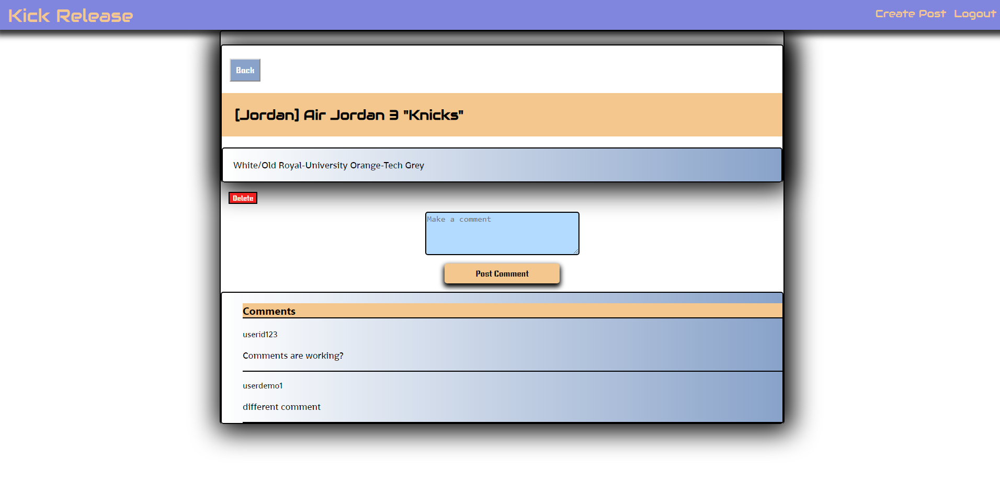

# Kick Release
## Live Demo
https://kick-release.yougene42193.now.sh/
## Summary
I created Kick Release for easy access to when popular shoes are going to be released. Users can sign up to view the list of releases
as well as post new releases. They can also go into each post to comment on the shoes that they are excited for.
## Screenshots
### Landing Page

### Register Page

### Log in Page

### Create Post Page

### Posts Page

### Single Post Page

## API Documentation
The API can be found at https://github.com/yougene42193/kick-release-server/
### /users 
* POST / creates a new user with a username and password. Verifies if the username is already taken and if the password fulfills the requirements.
### /posts
* GET / gets all of the posts that have been created by the users.
* POST / post a new post to the list with the requirements of title, brand, release date and description
* DELETE / delete a post from the list
### /posts/:post_id
* GET / get a specific post from the list
### /posts/:post_id/comments
* GET / get comments for the specific post
### /comments
* POST / post a new comment to a post
## Built With
* React
* CSS
* NodeJS
* Enzyme
